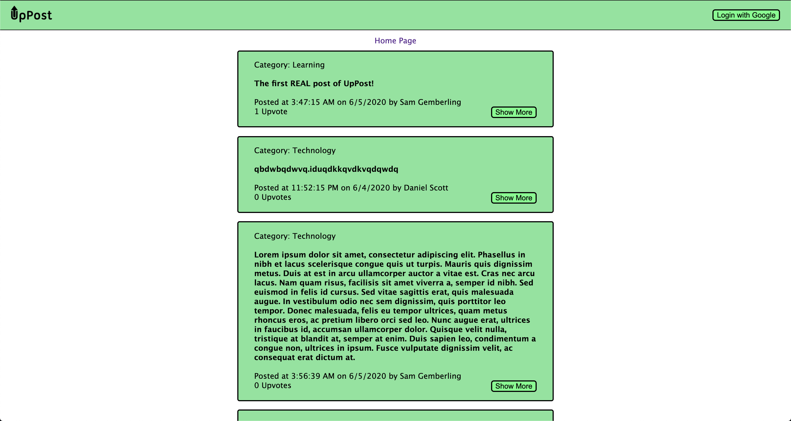
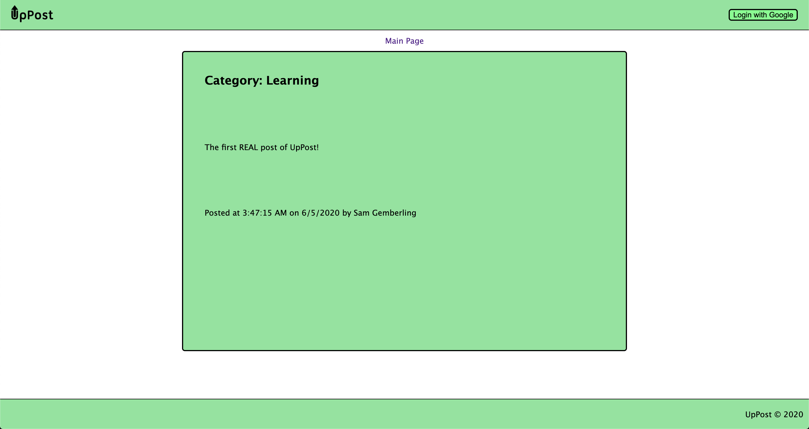

# UpPost

## Screenshots

## Technologies Used

- HTML
- CSS
- JavaScript
- Node.js
- Express
- mongoDB
- mongoose

## Getting Started

[Click Here to View Application](https://uppost.herokuapp.com)

[Click Here to View the Planning Process](https://trello.com/b/7DLnOCSX/uppost)

## Future Enhancements

1. Ability to filter shown posts by category.
2. Be able to post comments.
3. Ability to see all of your posts on the profile page.
4. Add more responsive design.